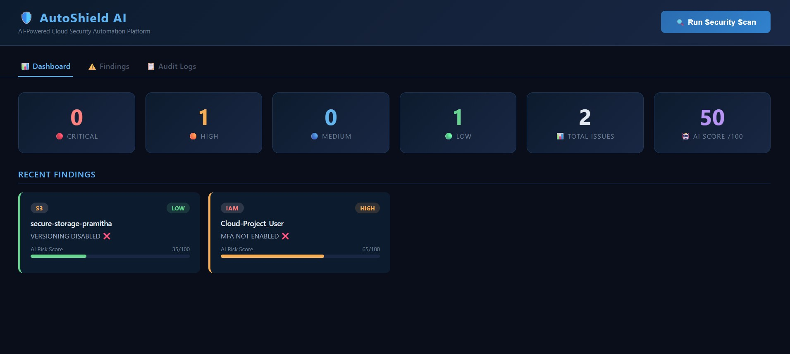
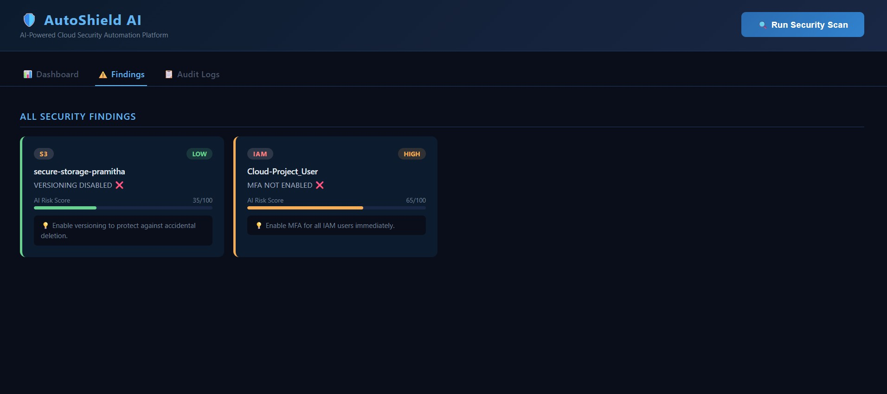
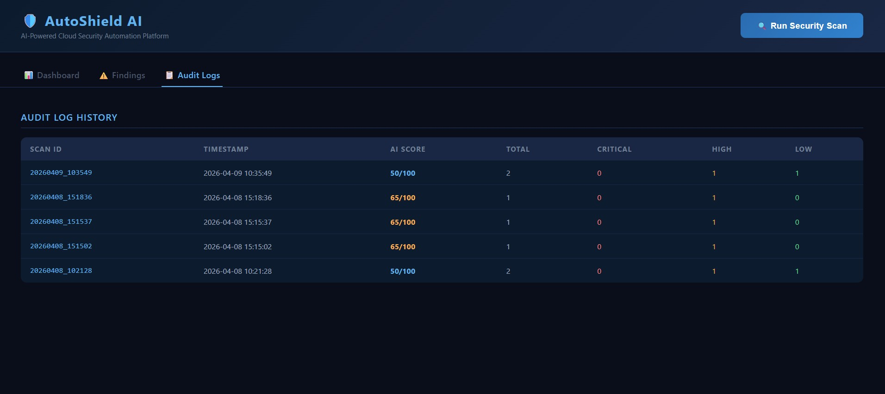

# 🛡️ AutoShield AI
### AI-Powered Cloud Security Automation Platform


---

## 💡 Overview
**AutoShield AI** is an AI-powered cloud security automation platform that scans AWS resources, detects misconfigurations, analyzes risks using AI scoring, and automatically remediates security issues.

> "Smart Cloud Security Engineer Bot" — built for real-world enterprise use cases.

---

## 🚀 Features

| Feature | Description |
|---------|-------------|
| ☁️ Cloud Scanning | Scans S3, IAM, Security Groups |
| ⚠️ Misconfiguration Detection | Detects public buckets, open ports, weak IAM |
| 🤖 AI Risk Scoring | Scores risks 0-100 with recommendations |
| 🛡️ Auto Remediation | Automatically fixes detected issues |
| 📋 Audit Logging | JSON-based audit trail for all scans |
| 📊 Interactive Menu | Easy-to-use CLI interface |

---

## 🧠 Architecture

```
AutoShield-AI/
├── scanner/          # AWS resource scanners
│   ├── s3_scanner.py
│   ├── iam_scanner.py
│   └── sg_scanner.py
├── detector/         # Misconfiguration detection engine
│   └── detector.py
├── ai_engine/        # AI risk scoring engine
│   └── risk_scorer.py
├── remediation/      # Auto remediation engine
│   └── remediator.py
├── logs/             # Audit logs (JSON)
├── config/           # AWS configuration
└── main.py           # Main entry point
```

---

## 🔧 Tech Stack

- **Cloud:** Amazon Web Services (AWS)
- **Language:** Python 3.14
- **AWS SDK:** Boto3
- **Security:** IAM, S3, EC2 Security Groups
- **AI Engine:** Rule-based ML Risk Scoring
- **Logging:** JSON Audit Trail

---

## ⚙️ Installation

```bash
# Clone repository
git clone https://github.com/Pramitha-Rupasingha/AutoShield-AI.git
cd AutoShield-AI

# Create virtual environment
python -m venv venv
venv\Scripts\activate

# Install dependencies
pip install boto3 fastapi uvicorn python-dotenv requests colorama
```

---

## 🔑 Configuration

Create `.env` file in root:

```env
AWS_ACCESS_KEY_ID=your_access_key
AWS_SECRET_ACCESS_KEY=your_secret_key
AWS_REGION=us-east-1
```

---

## ▶️ Usage

```bash
python main.py
```

```
╔══════════════════════════════════════════════╗
║        AutoShield AI  🛡️                     ║
║   AI-Powered Cloud Security Automation       ║
╚══════════════════════════════════════════════╝

  [1] Run Full Security Scan
  [2] Run Scan + AI Analysis
  [3] Run Scan + AI Analysis + Auto Remediation
  [4] View Audit Log History
  [5] Exit
```

---

## 📊 Sample Output

```
[RISK] Bucket: my-bucket
  → VERSIONING DISABLED ❌

[RISK] User: admin-user
  → MFA NOT ENABLED ❌

🤖 AI Overall Risk Score : 50/100
⚠️  MEDIUM — Review and fix issues.

✅ Auto Fixed : 1
⚠️  Manual Fix : 1
```

---
## 📸 Screenshots







## 👨‍💻 Developer

**Pramitha Rupasingha**
- 🎓 SLIIT — Cyber Security
- 🔗 [GitHub](https://github.com/Pramitha-Rupasingha)

---

## 📜 License
MIT License — Free to use and modify.